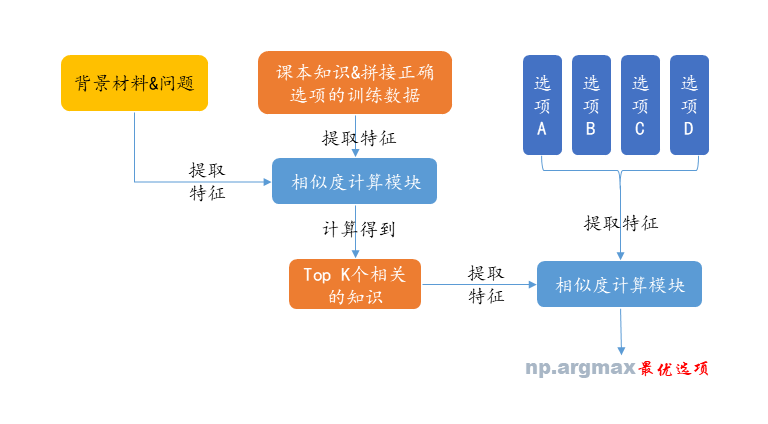
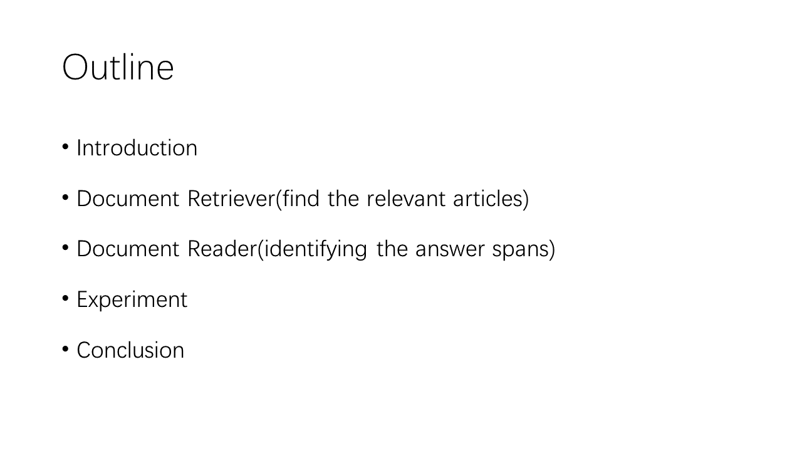
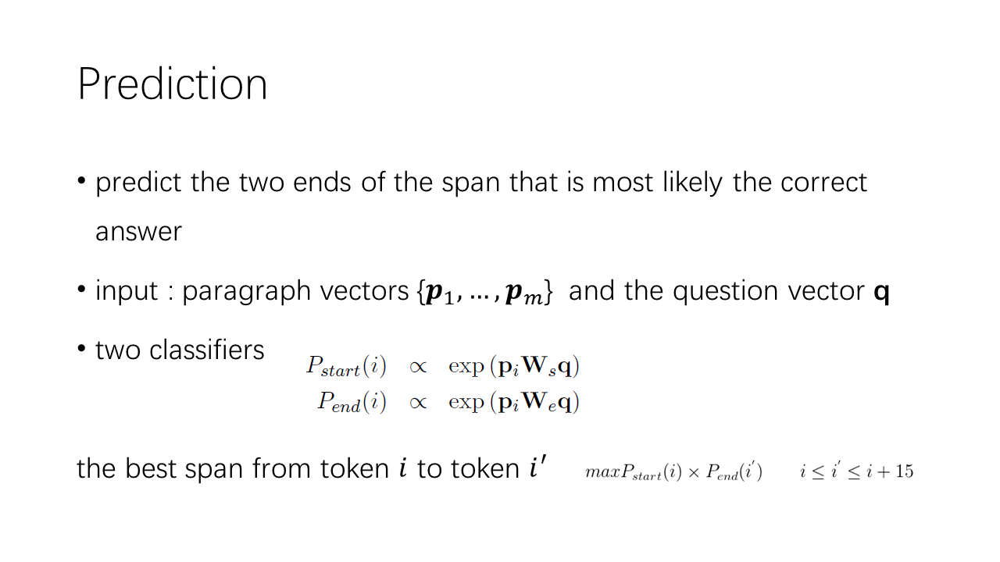

# 作业3：问答系统

##  1、可行的流程：

  * 自行设计相似度计算函数，根据背景材料和问题利用相似度函数计算得到最相关的课本句子。之后将找到的top k个最相关的课本句子与问题一起与四个选项计算匹配度，选择合理的模型和损失函数，训练模型，选择最优选项。

  * 简单说，就两步（见流程图），先根据题目找相关课本知识，再根据题目和找到的课本知识选择最优选项。其中最重要的就是怎么找到相关知识，以及怎么选择最优选项？这两个问题分别对应于相似度函数的设计以及损失函数选取。（当然可能存在题目找不到相关的课本知识的情况，这一问题在本次作业不需要特别处理）

  * 一些提示：
  * a）相似度计算函数
    一些有用的特征，如TFIDF、BM2.5、n-gram重合度等。
          一些有用的函数，如余弦距离函数、Jaccard距离函数。
  * b）损失函数
    cross entropy loss：将正确答案的概率视为1，错误答案的概率视为0。这样四个选项的概率加起来为1，可以当作一个概率分布，需要做的事情就是拟合这样的分布。
    max-margin loss：训练一个打分模型，模型给正确选项的分数为s1，给错误选项打分为s2。同一个题目中正确选项和其中一个错误选项的损失就可以写成 max(0, \lambda + s2 - s1)。其中 \lambda 是一个超参，可以自行调整。

  * 需要注意的点：
  * a）相似度计算函数如何设计？设计理由？
  * b）给的实现路径是算问题和课本知识之间相似度，可不可以直接找相似的题目，把相似的题目也当作知识？
  * c）计算相似度与匹配度时，用词级别特征，句子级别特征？词级别特征用词向量，还是用字符值？句子级别特征如何使用？

##  2、数据说明：
  * 训练、测试数据：按照已提交的作业的同学序号，随机从每位同学提交的前120道题目中抽取100题作为训练集，20题作为测试集，见train.txt，test.txt。
  * 外部知识：地理课本以及人工总结知识，见knowledge.txt。
      注：有部分同学未提交作业或者提交的作业标注错误比较严重，最终只用了102位同学的提交结果。

##  3、提交说明：
  * 将代码、报告打包成“学号_姓名_QA.zip”文件提交到ftp://114.212.191.119。
  * deadline：2017年12月21日 23:59

##  4、（optional）参考 reading wikipedia to answer open-domain questions，实现该论文。考虑到时间以及实现难度，并不强制要求实现。

## 待做(现在使用的是余弦相似度的方法,最多能到38%,使用神经网络能到45%左右,有时间实现一下)

*  我实现的方法

*  使用lstm神经网络的方法

